  

<h3 align="center">I build AI/ML systems where the objective is measurable.</h3>

<code>minimize(loss + latency + cost + uncertainty)</code>

  <a href="https://github.com/premxai/kerna"><b>Kerna</b></a> &nbsp; // &nbsp;
  <a href="https://www.cryoweb.xyz/"><b>Cryo</b></a> &nbsp; // &nbsp;
  <a href="https://www.norinote.xyz/"><b>Nori</b></a> &nbsp; // &nbsp;
  <a href="https://web-production-91496.up.railway.app/poster/"><b>Emotion Engine</b></a>

<b>Selected signals</b>

- Production LLM routing: **50K requests/day**, **3 models**, p95 **4s -> 1.5s**
- Generative-agent research: **72-feature LSTM**, **205,940 agent-step records**
- Nori: **31,000+ company ATS registry**, **120+ matches/day**, **95% duplicate filtering**

  <a href="https://premxai.com"><b>Portfolio</b></a> &nbsp; | &nbsp;
  <a href="https://linkedin.com/in/premxai"><b>LinkedIn</b></a> &nbsp; | &nbsp;
  <a href="mailto:prem.b.kanaparthi@gmail.com"><b>Email</b></a>

<code>AI/ML Engineer</code> | <code>United States</code> | <code>Open to relocation</code>

